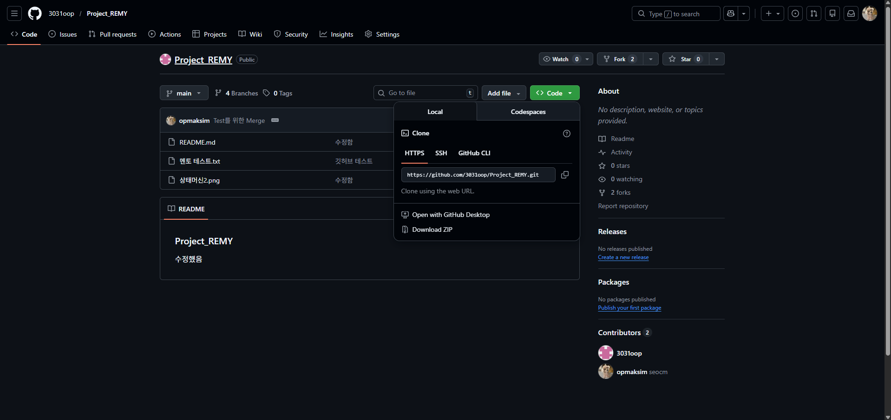
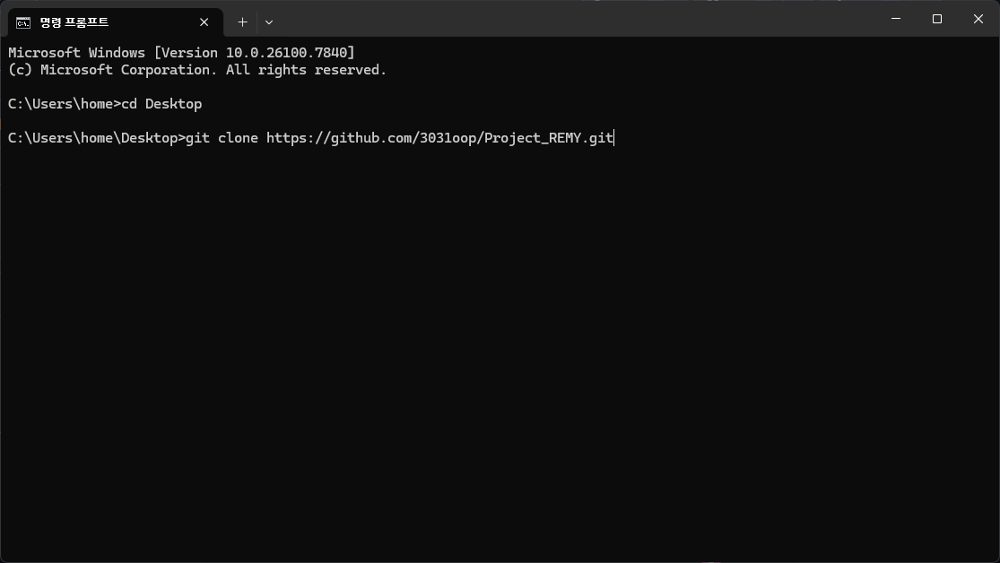
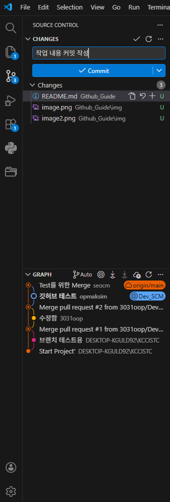

# 깃허브 사용법


### 1. git 주소 복사

깃 주소를 원하는 디렉토리에 git clone "주소"로 복사한다.




### 2. 자신의 브랜치 생성

해당 디렉토리로 이동하여 자신이 원하는 브랜치 이름으로 변경한다.
```
git branch "이름"
ex) git git branch Dev_SCM
```

### 3. 브랜치 체크아웃

앞으로 사용할 브랜치를 자신이 만든 브랜치로 변경한다.
```
git checkout "이름"
ex) git checkout Dev_SCM
```

### 4. 디렉토리에서 작업

디렉토리 내에서 작업한다.

### 5. 작업 내용 add

vscode 내에 있는 git에서 커밋한다.



### 6 작업 내용 Push

작업 내용을 Push한다.